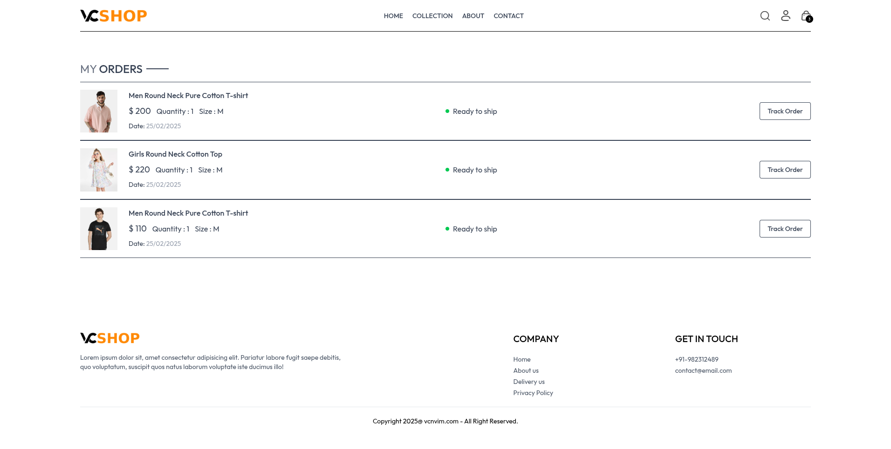

# vcshop
📝 VC Shop App – Documentation Pages (v1)

1. Home Page (home.png)

Overview:
Displays top products with images, names, prices.

Hero section for banner or promotion.

Navigation bar with links (Home, Shop, Cart, etc.)

Features:
Product preview.

Navigation bar.

Responsive layout (assumed from design).

2. Collection Page (collection.png)

Overview:
Lists products from a selected category.

Filter or sort options (if implemented).

Product cards in grid format.

Features:
Category-wise product display.

Product cards with add-to-cart button.

Dynamic routing for categories (assumed).

3. Product Page (product.png)

Overview:
Individual product details page.

Shows image, name, description, price.

Quantity selector and "Add to Cart" button.

Features:
Dynamic product rendering.

Cart integration.

Stock availability or quantity control.

4. Cart Page (cart.png)

Overview:
Shows items added to the cart.

Allows quantity update or removal of items.

Subtotal and total price shown.

Features:
Cart state management (Redux Toolkit likely).

Checkout button.

Remove/update actions per item.

5. Orders Page (orders.png)

Overview:
Displays list of placed orders.

Each order shows products, total amount, and status.

Features:
Order tracking UI.

Past order listing.

Backend integration assumed for dynamic data.

6. About Page (about.png)

Overview:
Displays app or team information.

Static text or bio.

Features:
Informational.

Static route.

7. Contact Page (contact.png)

Overview:
Contact form for users.

Inputs: name, email, message.

Submit button.

Features:
Contact form submission (email/DB or console).

Input validation (assumed).

